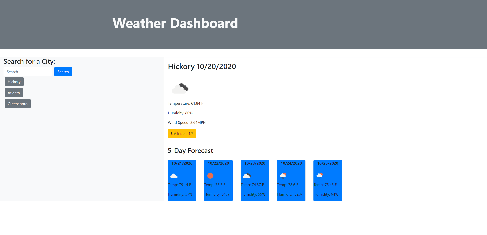
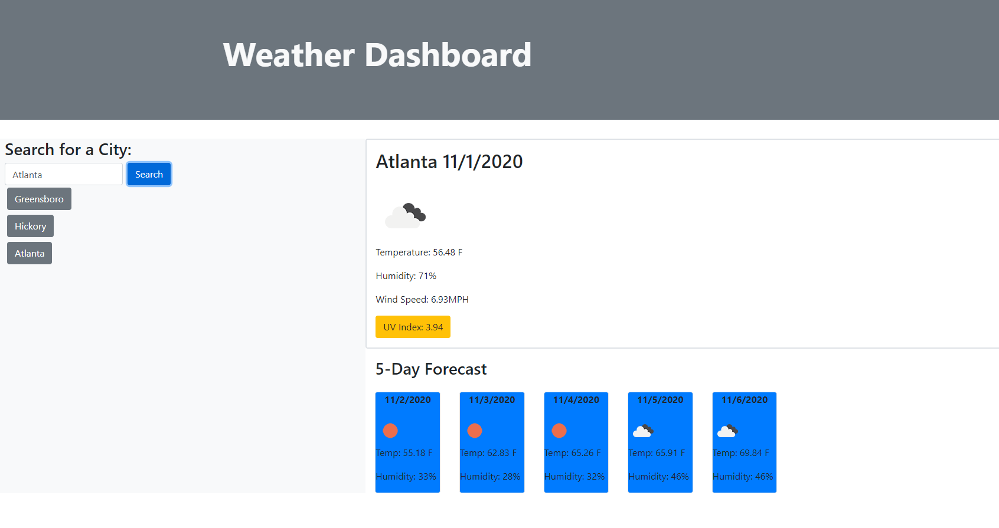
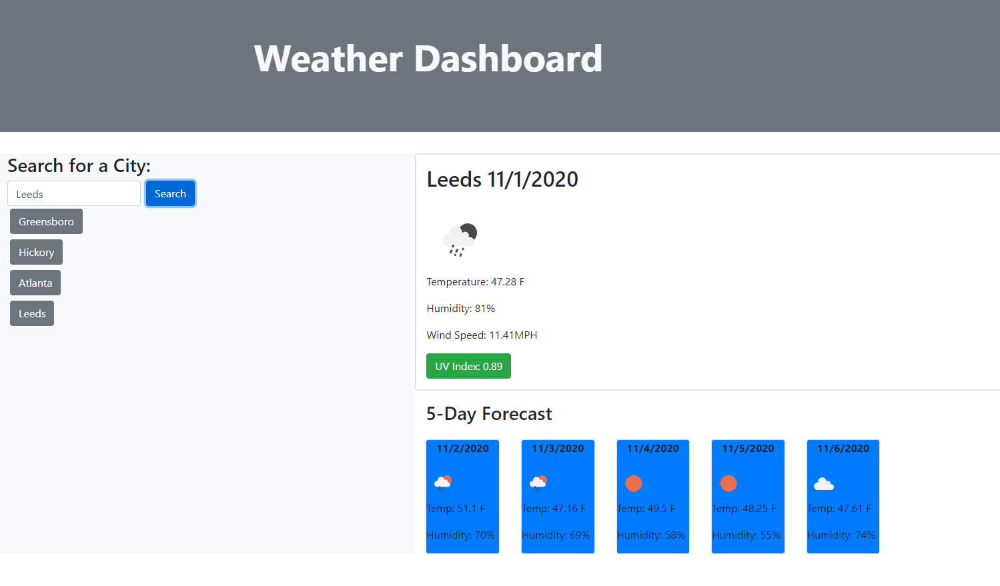

# Weather Dashboard

This is a simple weather dashboard which uses the open weather map api in order to display both current and future weather conditions for a city specified by user input

In order to use the application, download the files and open index.html in the browser of your choosing or view the finished product hosted on Github pages [here](https://brendonstahl97.github.io/Weather-Dashboard/)

## Technologies Used
  * HTML
  * CSS
  * JavaScript
  * OpenWeatherMap API

## Example Photo

## License

Code released under the [MIT](https://github.com/StartBootstrap/startbootstrap-stylish-portfolio/blob/gh-pages/LICENSE) license.
